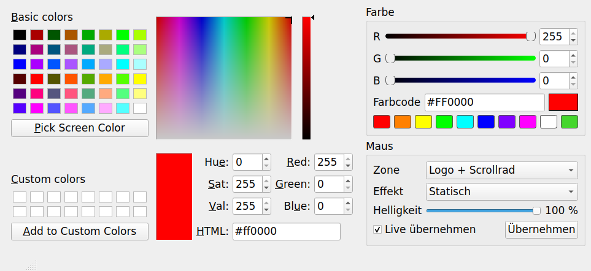
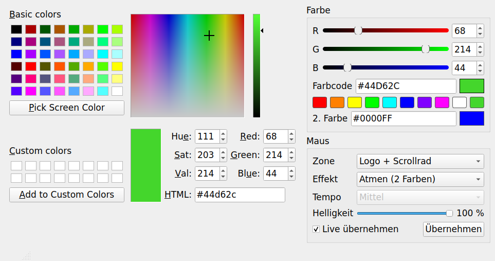

# Razer Legacy Mouse Tools

Three small PyQt5 desktop tools for configuring older Razer mice without Razer Synapse.

| Tool | Mouse | USB ID | Configures |
|---|---|---|---|
| `razer_deathadder_chroma_color.py` | Razer DeathAdder Chroma | `1532:0043` | LED colour, effect, brightness (logo and scroll wheel) |
| `razer_deathadder_elite_color.py` | Razer DeathAdder Elite | `1532:005C` | LED colour, effect, brightness (logo and scroll wheel) |
| `copperhead_config.py` | Razer Copperhead (e.g. Tempest Blue) | `1532:0101` | 5 hardware profiles: DPI, polling rate, active profile |

> **Status:** The tools have been tested against simulated devices only (`--dry-run`), not yet against real hardware. For both DeathAdder models, the transport layer has been confirmed on hardware with the OpenMouse test tool. See [Verification status](#verification-status). Reports of results are welcome.

---

## Requirements

- Python 3.9+
- PyQt5

```
pip install pyqt5 hidapi libusb1
```

`hidapi` is needed by the two DeathAdder tools, `libusb1` by the Copperhead tool.

Close Razer Synapse, OpenMouse Bridge and similar software before use. Two programs talking to the mouse at the same time can mix up replies.

---

## DeathAdder Chroma and DeathAdder Elite – LED colour

| DeathAdder Chroma | DeathAdder Elite |
|---|---|
|  |  |

Both tools share the same interface and transport code. They differ in the LED command set, because the two mice belong to different firmware generations.

### Features

- Colour selection via colour field, RGB sliders (0–255), hex code input or presets. All inputs stay in sync.
- Zone: logo, scroll wheel, or both.
- Brightness 0–100 %.
- Live mode: changes are sent while dragging, debounced to 60 ms.
- Last settings are restored on start.
- The firmware version is read on connect and shown in the status bar, as a check that the control channel was reached.

Effects per model:

| Effect | Chroma | Elite |
|---|---|---|
| Static | ✓ | ✓ |
| Breathing, one colour | ✓ | ✓ |
| Breathing, two colours | – | ✓ |
| Breathing, random colours | – | ✓ |
| Reactive (lights up on click, 4 speeds) | – | ✓ |
| Blinking | ✓ | – |
| Spectrum | ✓ | ✓ |
| Off | ✓ | ✓ |

The Elite tool shows a second colour field for two-colour breathing and a speed selection for the reactive effect. Both are only enabled when the matching effect is selected.

### Usage

```
python razer_deathadder_chroma_color.py               # GUI
python razer_deathadder_chroma_color.py --set #44D62C # set static colour without GUI, e.g. for autostart
python razer_deathadder_chroma_color.py --dry-run     # GUI without mouse, packets printed to stdout
```

The same options apply to `razer_deathadder_elite_color.py`.

### Platform notes

- **Windows:** works with the stock HID driver; no extra driver needed. Windows lists each HID collection of the mouse as a separate device. The tools open the Generic Desktop Mouse collection (`0x0001:0x0002`) first, which carries the control channel.
- **Linux:** needs access to `/dev/hidraw*`, and the mouse must not be bound by `openrazer-driver` at the same time. Example udev rule (`/etc/udev/rules.d/99-razer-deathadder.rules`), covering both models:

  ```
  KERNEL=="hidraw*", ATTRS{idVendor}=="1532", ATTRS{idProduct}=="0043", MODE="0660", TAG+="uaccess"
  KERNEL=="hidraw*", ATTRS{idVendor}=="1532", ATTRS{idProduct}=="005c", MODE="0660", TAG+="uaccess"
  ```

  Then reload with `sudo udevadm control --reload && sudo udevadm trigger`.

### Protocol: common framing

90-byte HID feature reports on report ID 0, as documented in OpenMouse `mouse-protocol` (`src/razer/codec.ts`):

| Byte | Content |
|---|---|
| 0 | status (`0x00` in requests; `0x02` = ok in replies) |
| 1 | transaction ID: `0xFF` for the Chroma, `0x3F` for the Elite |
| 5 | argument length |
| 6 | command class |
| 7 | command ID |
| 8… | arguments |
| 88 | checksum: XOR of bytes 2–87 |

A wrong transaction ID is not answered with an error; the mouse simply does not reply.

LED IDs are the same on both models: `0x01` scroll wheel, `0x04` logo. The first argument `0x01` selects the persistent store.

### Protocol: DeathAdder Chroma (standard LED commands, class `0x03`)

| Command | Arguments |
|---|---|
| `0x03 0x00` set LED state | store, LED, on/off |
| `0x03 0x01` set LED colour | store, LED, R, G, B |
| `0x03 0x02` set LED effect | store, LED, effect (`0x00` static, `0x01` blinking, `0x02` breathing, `0x04` spectrum) |
| `0x03 0x03` set LED brightness | store, LED, 0–255 |

### Protocol: DeathAdder Elite (extended matrix commands, class `0x0F`)

`0x0F 0x02` set effect; arguments start with store, LED, effect ID:

| Effect | Length | Arguments |
|---|---|---|
| off | 6 | store, LED, `0x00`, 0, 0, 0 |
| static | 9 | store, LED, `0x01`, 0, 0, 1, R, G, B |
| breathing, random | 6 | store, LED, `0x02`, 0, 0, 0 |
| breathing, one colour | 9 | store, LED, `0x02`, 1, 0, 1, R, G, B |
| breathing, two colours | 12 | store, LED, `0x02`, 2, 0, 2, R1, G1, B1, R2, G2, B2 |
| spectrum | 6 | store, LED, `0x03`, 0, 0, 0 |
| reactive | 9 | store, LED, `0x05`, 0, speed (1 fast … 4 slow), 1, R, G, B |

| Command | Arguments |
|---|---|
| `0x0F 0x04` set brightness | store, LED, 0–255 |
| `0x0F 0x84` get brightness | store, LED, 0 |

---

## Copperhead – profiles and sensitivity


### Features

- Five hardware profiles, each with:
  - DPI: 400, 800, 1600 or 2000 (the only steps the hardware supports)
  - Polling rate: 125, 500 or 1000 Hz
- Selection of the active profile.
- Changed profiles are marked; only those are written.
- Every written profile is read back and compared (DPI, polling rate, button map).

Button mappings and lighting are not configurable. The mouse's lighting cannot be controlled; no known source documents a command for it.

### Safety measures

- Each profile block also contains the button mapping. The tool copies it byte for byte from the mouse and writes it back unchanged; it never generates one itself.
- A profile read with an invalid checksum is locked in the GUI (⚠) and is never written.
- The mouse is only opened for the duration of a read or write. It is unavailable as an input device for that moment and returns afterwards.

### Usage

```
python copperhead_config.py            # GUI
python copperhead_config.py --dry-run  # simulated mouse
```

### Platform notes

- **Windows:** install [UsbDk](https://github.com/daynix/UsbDk/releases). libusb uses it to reach the mouse without replacing its driver.
  **Do not use Zadig.** Zadig replaces the HID driver with WinUSB, after which the mouse no longer works as a mouse.
- **Linux:** the kernel driver is detached for the transfer and re-attached afterwards. Example udev rule (`/etc/udev/rules.d/99-razer-copperhead.rules`):

  ```
  SUBSYSTEM=="usb", ATTRS{idVendor}=="1532", ATTRS{idProduct}=="0101", MODE="0660", TAG+="uaccess"
  ```

### Protocol

Ported from razercfg by Michael Büsch (`librazer/hw_copperhead.c`, based on reverse engineering). Unlike later Razer mice, the Copperhead uses raw USB class control transfers with recipient "other", not HID feature reports.

| Operation | Direction / request | wValue | wIndex | Data |
|---|---|---|---|---|
| read active profile | IN `0xA3` / `0x01` | 1 | 0 | 1 byte |
| request profile N | OUT `0x23` / `0x09` | 2 | 3 | `[N]` |
| read requested profile | IN `0xA3` / `0x01` | 1 | 0 | 342 bytes (struct offset 6…) |
| upload chunk j | OUT `0x23` / `0x09` | j (1–6) | 0 | 64 bytes |
| commit profile N | OUT `0x23` / `0x09` | 2 | 3 | `[N]` |
| select active profile | OUT `0x23` / `0x09` | 2 | 1 | `[N]` |

Profile struct, 348 bytes, little endian:

| Offset | Content |
|---|---|
| 0 | packet length (`0x015C`) |
| 2 | magic (`0x0002`) |
| 4 | profile number (1–5) |
| 6 / 8 / 10 | reply length / reply magic / reply profile number |
| 12 | DPI selector: `1` = 2000, `2` = 1600, `3` = 800, `4` = 400 |
| 13 | polling selector: `1` = 1000 Hz, `2` = 500 Hz, `3` = 125 Hz |
| 14–345 | button map (332 bytes) |
| 346 | checksum: XOR of all preceding 16-bit little-endian words |

razercfg waits 250 ms between profile commits; this tool does the same.

---

## Verification status

| Item | Status |
|---|---|
| DeathAdder Chroma: packet format, checksum, transaction ID `0xFF` | Confirmed on hardware via the OpenMouse test tool (firmware read, DPI and polling-rate write and read-back; firmware 1.8, Windows, wired) |
| DeathAdder Chroma: LED state, colour and effect commands | Documented identically in OpenRazer and razercfg; not yet tested with this tool |
| DeathAdder Chroma: blinking effect, brightness command | From OpenRazer only; not in razercfg; untested |
| DeathAdder Elite: packet format, checksum, transaction ID `0x3F` | Confirmed on hardware via the OpenMouse test tool (firmware read, DPI and polling-rate write and read-back; firmware 1.6, Windows, wired) |
| DeathAdder Elite: all LED commands | From OpenRazer; packet layouts checked byte for byte against its source; not yet tested with this tool |
| Copperhead: complete protocol | From razercfg only; untested with this tool |

---

## Credits

- [OpenMouse Project](https://github.com/OpenMouse-Project) – Razer packet format, device table and transaction IDs (`mouse-protocol`), hardware test tool
- [razercfg](https://github.com/mbuesch/razer) by Michael Büsch – Copperhead protocol, DeathAdder Chroma LED commands
- [OpenRazer](https://github.com/openrazer/openrazer) – standard and extended matrix LED commands

## License

[Creative Commons Attribution-NonCommercial 4.0 International (CC BY-NC 4.0)](https://creativecommons.org/licenses/by-nc/4.0/).

The projects credited above are published under their own licenses (razercfg: GPL-2.0-or-later, OpenRazer: GPL-2.0, OpenMouse: AGPL-3.0). This repository does not contain code copied from them; protocol details were taken from their source and documentation.

## Disclaimer

Not affiliated with or endorsed by Razer Inc. "Razer", "DeathAdder" and "Copperhead" are trademarks of Razer Inc. Use at your own risk: writing to a device's configuration memory can, in the worst case, leave it misconfigured.
