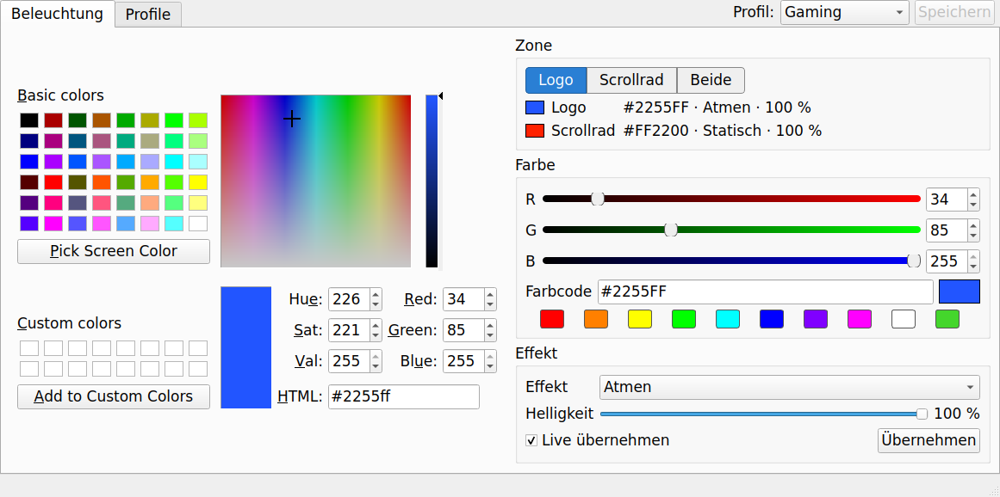
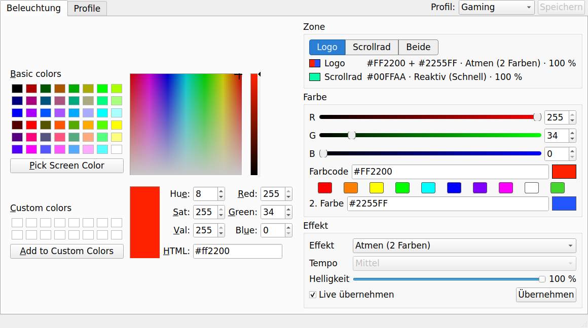
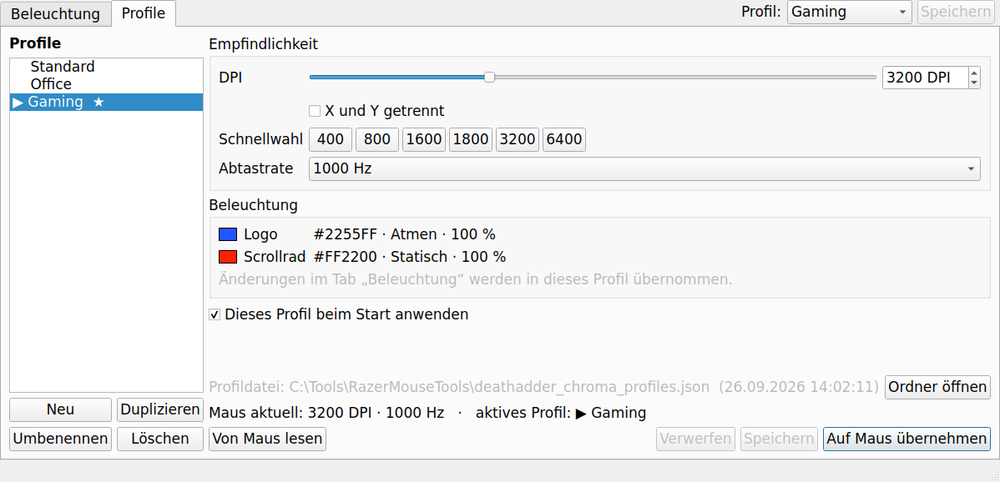
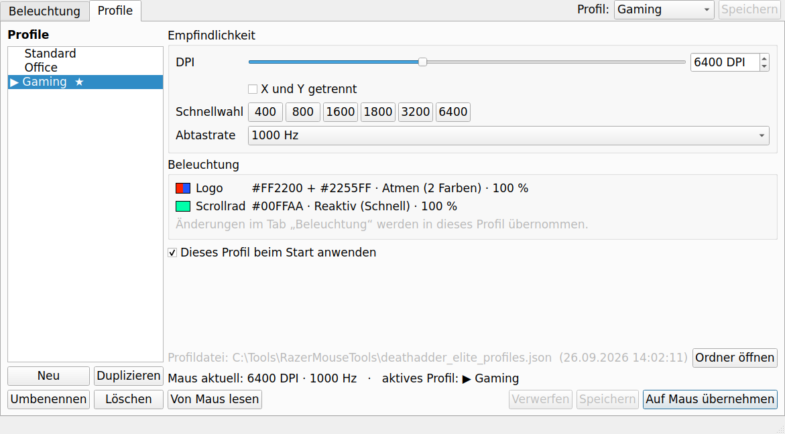
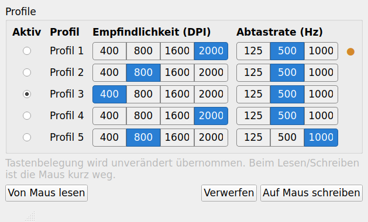

# Razer Legacy Mouse Tools

Small PyQt5 desktop tools for configuring older Razer mice without Razer Synapse. Each tool is a single file, targets one mouse model and talks to it directly over USB.

| Tool | Mouse | USB ID | Configures |
|---|---|---|---|
| `razer_deathadder_chroma_color.pyw` | Razer DeathAdder Chroma | `1532:0043` | Lighting per zone, DPI, polling rate, profiles |
| `razer_deathadder_elite_color.pyw` | Razer DeathAdder Elite | `1532:005C` | Lighting per zone, DPI, polling rate, profiles |
| `copperhead_config.py` | Razer Copperhead (e.g. Tempest Blue) | `1532:0101` | 5 hardware profiles: DPI, polling rate, active profile |

> **Status:** The transport layer of both DeathAdder models (packet format, firmware read, DPI and polling-rate write/read-back) has been confirmed on hardware with the OpenMouse test tool. The LED commands and the Copperhead protocol have not been confirmed on hardware yet. See [Verification status](#verification-status). Reports are welcome.

---

## Contents

- [Requirements](#requirements)
- [DeathAdder Chroma and DeathAdder Elite](#deathadder-chroma-and-deathadder-elite)
- [Copperhead](#copperhead)
- [Protocol](#protocol)
- [Verification status](#verification-status)
- [Credits](#credits) · [License](#license) · [Disclaimer](#disclaimer)

---

## Requirements

- Windows 10/11 (primary platform) or Linux
- Python 3.9+

```
pip install pyqt5 hidapi libusb1
```

`hidapi` is needed by the two DeathAdder tools, `libusb1` by the Copperhead tool.

Close Razer Synapse, OpenMouse Bridge and similar software before use. Two programs talking to the same mouse at once can mix up replies.

On Windows, `.pyw` files start without a console window (double-click, or `pythonw`).

---

## DeathAdder Chroma and DeathAdder Elite

Both tools have the same structure: a **Beleuchtung** (lighting) tab and a **Profile** tab. The user interface is in German.

### Lighting

| DeathAdder Chroma | DeathAdder Elite |
|---|---|
|  |  |

- **Independent zones:** logo and scroll wheel each have their own colour, effect and brightness. The zone buttons *Logo / Scrollrad / Beide* select what the controls edit; the overview shows both zones. *Beide* copies only the value you change to both zones and leaves the rest as it is.
- **Colour input:** colour field, R/G/B sliders, hex code, 10 presets – all in sync.
- **Live mode:** changes are sent while you drag (debounced to 60 ms). Only the zone that changed is sent. With live mode off, *Übernehmen* sends.

Effects per model:

| Effect | Chroma | Elite |
|---|---|---|
| Static | ✓ | ✓ |
| Breathing, one colour | ✓ | ✓ |
| Breathing, two colours | – | ✓ |
| Breathing, random colours | – | ✓ |
| Reactive (lights up on click, 4 speeds) | – | ✓ |
| Blinking | ✓ | – |
| Spectrum | ✓ | ✓ |
| Off | ✓ | ✓ |

The Elite shows a second colour field and a speed selection; they are enabled only for the effects that use them. Breathing speed is fixed by the firmware on both models – no documented command sets it.

### Profiles

| DeathAdder Chroma | DeathAdder Elite |
|---|---|
|  |  |

Neither mouse has onboard profile slots, so the tools manage profiles themselves. A profile contains:

- DPI – X and Y linked or separate (Chroma 100–10 000, Elite 100–16 000, slider in steps of 50, quick buttons for common values)
- polling rate – 125, 500 or 1000 Hz
- lighting of both zones

Working with profiles:

- **Apply:** select a profile and click *Auf Maus übernehmen*, or double-click it. DPI and polling rate are written to the mouse's persistent memory and read back for verification.
- **Quick switch:** the *Profil* box in the top-right corner applies a profile immediately, from either tab.
- **Active profile:** the last applied profile is marked `▶`. The status line shows the mouse's current values and adds *(weicht ab)* if they differ from the active profile – e.g. after the Elite's DPI buttons were used.
- **Lighting changes:** with the active profile shown in the profile tab, every change in the lighting tab goes into that profile. *Speichern* (also next to the quick switch) stores it, *Verwerfen* restores the saved lighting on the mouse.
- **Unsaved changes** are marked `●`. Switching profiles or closing the window asks whether to save, discard or cancel. *Ohne Speichern übernehmen* tries changes on the mouse without saving them.
- **Startup profile:** *Dieses Profil beim Start anwenden* (`★`) applies a profile whenever the tool starts.

The Elite's two buttons behind the wheel keep their firmware function (DPI up/down); without onboard profiles they cannot switch profiles.

### Profile file

Profiles are stored as readable JSON **next to the program**, so they are easy to back up or edit:

| Tool | File |
|---|---|
| Chroma | `deathadder_chroma_profiles.json` |
| Elite | `deathadder_elite_profiles.json` |

- The file is created on the first start and rewritten on every change.
- The profile tab shows its path and last-change time; *Ordner öffnen* opens the folder.
- Profiles from an earlier version stored in `%LOCALAPPDATA%\OpenDev\…` are copied next to the program on first start.
- If the program folder is not writable (e.g. under *Program Files*), the file stays in `%LOCALAPPDATA%\OpenDev\…`; the status bar says so.
- An unreadable file is never overwritten: it is kept as `…profiles.defekt-<date-time>.json` and a fresh file is started.

Example (Elite zones additionally store `color2` and `speed`):

```json
{
  "version": 1,
  "startup": "Gaming",
  "active": "Gaming",
  "profiles": [
    {
      "name": "Gaming",
      "dpi_x": 3200,
      "dpi_y": 3200,
      "polling_hz": 1000,
      "lighting": {
        "logo":   {"color": "#2255FF", "effect": "Atmen",    "brightness": 255},
        "scroll": {"color": "#FF2200", "effect": "Statisch", "brightness": 255}
      }
    }
  ]
}
```

### Command line

```
pythonw razer_deathadder_chroma_color.pyw                    # GUI
python  razer_deathadder_chroma_color.pyw --profile "Gaming" # apply a profile without GUI (e.g. autostart)
python  razer_deathadder_chroma_color.pyw --list-profiles    # list profiles and the file path
python  razer_deathadder_chroma_color.pyw --set #44D62C      # static colour on both zones, no GUI
python  razer_deathadder_chroma_color.pyw --dry-run          # GUI without mouse, packets printed to stdout
```

The same options apply to `razer_deathadder_elite_color.pyw`. `--profile` returns a non-zero exit code on error. If no mouse is found, the GUI starts in simulation mode.

### Platform notes

- **Windows:** works with the stock HID driver, no extra driver needed. Windows lists each HID collection of the mouse as a separate device; the tools open the Generic Desktop Mouse collection (`0x0001:0x0002`), which carries the control channel.
- **Linux:** needs access to `/dev/hidraw*`, and the mouse must not be bound by `openrazer-driver` at the same time. Example udev rule (`/etc/udev/rules.d/99-razer-deathadder.rules`):

  ```
  KERNEL=="hidraw*", ATTRS{idVendor}=="1532", ATTRS{idProduct}=="0043", MODE="0660", TAG+="uaccess"
  KERNEL=="hidraw*", ATTRS{idVendor}=="1532", ATTRS{idProduct}=="005c", MODE="0660", TAG+="uaccess"
  ```

  Then reload with `sudo udevadm control --reload && sudo udevadm trigger`.

---

## Copperhead



- Five hardware profiles stored **on the mouse**, each with DPI 400/800/1600/2000 (the only steps the hardware supports) and polling rate 125/500/1000 Hz.
- Selection of the active profile.
- Changed profiles are marked; only those are written. Every written profile is read back and compared (DPI, polling rate, button map).

Button mappings and lighting are not configurable. No known source documents a lighting command for this mouse.

**Safety measures**

- Each profile block also contains the button mapping. The tool copies it byte for byte from the mouse and writes it back unchanged; it never generates one itself.
- A profile read with an invalid checksum is locked in the GUI (⚠) and never written.
- The mouse is opened only for the duration of a read or write. It is unavailable as an input device for that moment and returns afterwards.

**Usage**

```
python copperhead_config.py            # GUI
python copperhead_config.py --dry-run  # simulated mouse
```

**Platform notes**

- **Windows:** install [UsbDk](https://github.com/daynix/UsbDk/releases). libusb uses it to reach the mouse without replacing its driver.
  **Do not use Zadig.** Zadig replaces the HID driver with WinUSB, after which the mouse no longer works as a mouse.
- **Linux:** the kernel driver is detached for the transfer and re-attached afterwards. Example udev rule (`/etc/udev/rules.d/99-razer-copperhead.rules`):

  ```
  SUBSYSTEM=="usb", ATTRS{idVendor}=="1532", ATTRS{idProduct}=="0101", MODE="0660", TAG+="uaccess"
  ```

---

## Protocol

### DeathAdder: common framing

90-byte HID feature reports on report ID 0, as documented in OpenMouse `mouse-protocol` (`src/razer/codec.ts`):

| Byte | Content |
|---|---|
| 0 | status (`0x00` in requests; replies: `0x02` ok, `0x01` busy, `0x03` failure, `0x04` timeout, `0x05` unsupported) |
| 1 | transaction ID: `0xFF` for the Chroma, `0x3F` for the Elite |
| 5 | argument length |
| 6 | command class |
| 7 | command ID |
| 8… | arguments |
| 88 | checksum: XOR of bytes 2–87 |

A wrong transaction ID is not answered with an error; the mouse simply does not reply.

LED IDs are the same on both models: `0x01` scroll wheel, `0x04` logo. The first argument `0x01` selects the persistent store.

### DeathAdder: DPI and polling rate (both models)

| Command | Arguments |
|---|---|
| `0x04 0x85` read DPI | store → reply: store, X high, X low, Y high, Y low |
| `0x04 0x05` write DPI | store, X high, X low, Y high, Y low, 0, 0 |
| `0x00 0x85` read polling rate | → reply: 1000 / Hz |
| `0x00 0x05` write polling rate | 1000 / Hz |

**Timing:** these writes go to the mouse's flash and take tens of milliseconds. While busy, Windows answers the reply read with a read error instead of a *busy* status. The tools therefore send each request once and poll for the reply from 20 ms, doubling up to 100 ms, for at most 1 s – a write is never repeated.

### DeathAdder Chroma: standard LED commands (class `0x03`)

| Command | Arguments |
|---|---|
| `0x03 0x00` set LED state | store, LED, on/off |
| `0x03 0x01` set LED colour | store, LED, R, G, B |
| `0x03 0x02` set LED effect | store, LED, effect (`0x00` static, `0x01` blinking, `0x02` breathing, `0x04` spectrum) |
| `0x03 0x03` set LED brightness | store, LED, 0–255 |

### DeathAdder Elite: extended matrix commands (class `0x0F`)

`0x0F 0x02` set effect; arguments start with store, LED, effect ID:

| Effect | Length | Arguments |
|---|---|---|
| off | 6 | store, LED, `0x00`, 0, 0, 0 |
| static | 9 | store, LED, `0x01`, 0, 0, 1, R, G, B |
| breathing, random | 6 | store, LED, `0x02`, 0, 0, 0 |
| breathing, one colour | 9 | store, LED, `0x02`, 1, 0, 1, R, G, B |
| breathing, two colours | 12 | store, LED, `0x02`, 2, 0, 2, R1, G1, B1, R2, G2, B2 |
| spectrum | 6 | store, LED, `0x03`, 0, 0, 0 |
| reactive | 9 | store, LED, `0x05`, 0, speed (1 fast … 4 slow), 1, R, G, B |

| Command | Arguments |
|---|---|
| `0x0F 0x04` set brightness | store, LED, 0–255 |
| `0x0F 0x84` get brightness | store, LED, 0 |

### Copperhead

Ported from razercfg by Michael Büsch (`librazer/hw_copperhead.c`, based on reverse engineering). Unlike later Razer mice, the Copperhead uses raw USB class control transfers with recipient "other", not HID feature reports.

| Operation | Direction / request | wValue | wIndex | Data |
|---|---|---|---|---|
| read active profile | IN `0xA3` / `0x01` | 1 | 0 | 1 byte |
| request profile N | OUT `0x23` / `0x09` | 2 | 3 | `[N]` |
| read requested profile | IN `0xA3` / `0x01` | 1 | 0 | 342 bytes (struct offset 6…) |
| upload chunk j | OUT `0x23` / `0x09` | j (1–6) | 0 | 64 bytes |
| commit profile N | OUT `0x23` / `0x09` | 2 | 3 | `[N]` |
| select active profile | OUT `0x23` / `0x09` | 2 | 1 | `[N]` |

Profile struct, 348 bytes, little endian:

| Offset | Content |
|---|---|
| 0 | packet length (`0x015C`) |
| 2 | magic (`0x0002`) |
| 4 | profile number (1–5) |
| 6 / 8 / 10 | reply length / reply magic / reply profile number |
| 12 | DPI selector: `1` = 2000, `2` = 1600, `3` = 800, `4` = 400 |
| 13 | polling selector: `1` = 1000 Hz, `2` = 500 Hz, `3` = 125 Hz |
| 14–345 | button map (332 bytes) |
| 346 | checksum: XOR of all preceding 16-bit little-endian words |

razercfg waits 250 ms between profile commits; this tool does the same.

---

## Verification status

| Item | Status |
|---|---|
| DeathAdder Chroma: packet format, checksum, transaction ID `0xFF`, firmware read, DPI and polling-rate write/read-back | Confirmed on hardware with the OpenMouse test tool (firmware 1.8, Windows, wired) |
| DeathAdder Elite: packet format, checksum, transaction ID `0x3F`, firmware read, DPI and polling-rate write/read-back | Confirmed on hardware with the OpenMouse test tool (firmware 1.6, Windows, wired) |
| DeathAdder Chroma: DPI/polling through this tool | Failed once with a read error; fixed by the timing described above; re-test pending |
| DeathAdder Chroma: LED commands | Documented identically in OpenRazer and razercfg; not yet confirmed on hardware |
| DeathAdder Elite: LED commands | From OpenRazer; packet layouts checked byte by byte against its source; not yet confirmed on hardware |
| Copperhead: complete protocol | From razercfg only; not yet tested |

---

## Credits

- [OpenMouse Project](https://github.com/OpenMouse-Project) – Razer packet format, device table and transaction IDs (`mouse-protocol`), hardware test tool
- [razercfg](https://github.com/mbuesch/razer) by Michael Büsch – Copperhead protocol, DeathAdder Chroma LED commands
- [OpenRazer](https://github.com/openrazer/openrazer) – standard and extended matrix LED commands

## License

[Creative Commons Attribution-NonCommercial 4.0 International (CC BY-NC 4.0)](https://creativecommons.org/licenses/by-nc/4.0/).

The projects credited above are published under their own licenses (razercfg: GPL-2.0-or-later, OpenRazer: GPL-2.0, OpenMouse: AGPL-3.0). This repository does not contain code copied from them; protocol details were taken from their source and documentation.

## Disclaimer

Not affiliated with or endorsed by Razer Inc. "Razer", "DeathAdder" and "Copperhead" are trademarks of Razer Inc. Use at your own risk: writing to a device's configuration memory can, in the worst case, leave it misconfigured.
